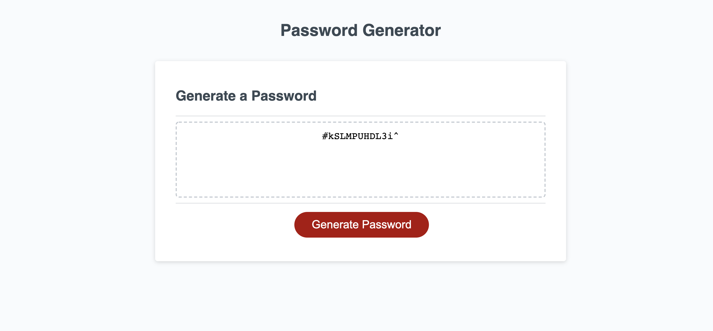

# Password_Generator
<<<<<<< HEAD
Allows the user to create a random password, the length of their choosing, with or without special characters

The user enters the website and must click the red "Generate Password" button. He is then given some prompts that he must answer.
1. How many characters do you want your password to have?
2. Do you want special characters (e.g &, *, (, or )) in your password?
3. Do you want numbers in your password?
4. Do you want Upper case letters in your password?
5. Do you want Lower case letters in your password?

After answering these questions are answered, your password will be generated randomly from the total array of all the characters you requested to have in your password and will string it together and post it on the webpage.

See below for a screenshot:

